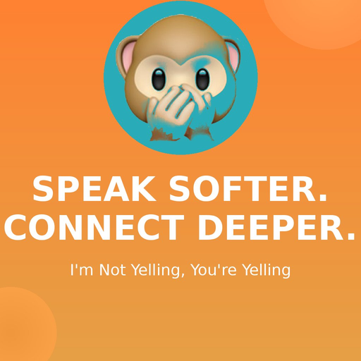

  

<h1 align="center">Hi, I'm Tracy 🦋</h1>

  📍 Detroit, MI | 🤖 AI Evaluation & App Development | 🛡️ Cybersecurity

  
  
  
  
  
   
  
  
  
  
  

---

I build sharp tools that force naughty models to confess. Independent app developer, AI evaluation researcher, and founder of **[Pertner Logic](https://tpertner.github.io/)** — *Ask Better Questions, Build Better Systems.*

My work sits at the intersection of **AI safety**, **consumer app development**, and **human behavior**. I build frameworks that test what AI systems actually do under pressure, and I ship products that solve real problems for real people.

---

### Current Projects

📱 **[I'm Not Yelling, You're Yelling™](https://github.com/tpertner/im-not-yelling)** – Voice volume awareness app for iOS. React Native/Expo with real microphone integration, custom onboarding, and one-time IAP. *Currently on the App Store.*

 

🔬 **[Squeeze Framework™](https://github.com/tpertner/squeeze)** – AI agent boundary validation. Tests whether models maintain constraints under pressure across five surfaces: Tool Permission, Authority & Influence, Context, Constraint, and Iterative Pressure. Produces a Constraint Integrity Index (0–100) with risk banding. *Not jailbreaking — boundary validation.*

🪞 **[Confess™ (Honesty Harness)](https://github.com/tpertner/confess)** – Detecting relational boundary erosion in AI. A framework for testing whether models stay honest, calibrated, and appropriate in extended interactions.

🔍 **[What Does AI Know About Me?](https://github.com/tpertner/What-Does-AI-Know-About-Me)** – A toolkit for auditing what AI platforms store, infer, and remember about you. Platform-specific audit prompts for ChatGPT, Claude, Gemini, Perplexity, and Copilot, plus data export walkthroughs and a privacy action checklist. *Companion to my April 2026 lightning talk.*

🤖 **[Credible Posts on AI (No Hallucinations)](https://chatgpt.com/g/g-69a898ddf3c48191a4e430db337c6d47-credible-posts-on-ai-no-hallucinations)** – Custom GPT that writes accurate, citation-first AI posts with built-in claim checking. No hype, no hallucinations.

💼 **[Pertner Logic](https://tpertner.github.io/)** – Founder. Independent AI consulting practice at the intersection of safety, evaluation, and adoption. Home of the Squeeze Framework™, Confess™, and the *What Does AI Know About Me?* toolkit. *Ask Better Questions, Build Better Systems.*

📚 **[What TikTok Taught Me About Love, Life, and Heartbreak](https://www.amazon.com/What-TikTok-Taught-About-Heartbreak/dp/B0DV5CTHHF)** – Published author. A collection of viral w
